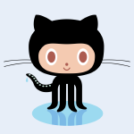

<!-- BEGIN TOP -->

# Pilot: Kiwi

> 

> 
Tech Support

>
> 
>
>  

- [Study Board](https://github.com/Kiwi/pilot/projects/1)
- People
  - [Learners](#learners) -
    [Randomizer](https://Kiwi.github.io/pilot/randomizer)
  - [Coaches](#coaches)
  - [Admins](#admins)
- Class Notes
  - [Vocabulary](./vocabulary)
    (_[PRs](https://github.com/Kiwi/pilot/pulls?q=label%3Avocabulary)_)
  - [Snippets](./snippets)
    (_[PRs](https://github.com/Kiwi/pilot/pulls?q=label%3Asnippets)_)
  - [Cheat Sheets](./cheat-sheets)
  - [Chill Zone](./chill-zone.md)
- [Guides](./guides)
  - [Study Tips](./guides/study-tips)
  - [Class Workflows](./guides/class-workflows)
  - [Planning and Collaborating](https://github.com/DeNepo/planning-and-collaborating)

---

<!-- END TOP -->

<!-- BEGIN MODULES -->

## Modules

Take your first steps into collaborative programming.

### [0. Precourse.](https://github.com/DeNepo/precourse): 1 week

> [check-ins](https://github.com/Kiwi/pilot/issues/?q=milestone%3A"0.%20Precourse."+label%3Acheck-in)
> |
> [deliverables board](https://github.com/Kiwi/pilot/projects/1?card_filter_query=milestone%3A"0.%20Precourse."+label%3Adeliverable)
> |
> [retros](https://github.com/Kiwi/pilot/issues/?q=milestone%3A"0.%20Precourse."+label%3Aretro+label%3Acheck-in)
> || [milestone](https://github.com/Kiwi/pilot/milestone/1)

Set up your development environment and GitHub account, then find your way
around this repository so you're ready to roll on day 1.

- **Deliverables**:
  [listed in the module repository](https://github.com/DeNepo/precourse/tree/main/deliverables)

### [1. Workflows](https://github.com/DeNepo/workflows): 1 week

> [check-ins](https://github.com/Kiwi/pilot/issues/?q=milestone%3A"1.%20Workflows"+label%3Acheck-in)
> |
> [deliverables board](https://github.com/Kiwi/pilot/projects/1?card_filter_query=milestone%3A"1.%20Workflows"+label%3Adeliverable)
> |
> [retros](https://github.com/Kiwi/pilot/issues/?q=milestone%3A"1.%20Workflows"+label%3Aretro+label%3Acheck-in)
> || [milestone](https://github.com/Kiwi/pilot/milestone/2)

Learn the workflows you need to develop individually and in a group.

- **Week 1**: Chapters 0, 1, 2, 3 - _Local/remote workflows for **individual and
  collaborative development**._
  - **Individual Deliverable**:
    [Student Bio PR](https://github.com/DeNepo/workflows/blob/main/deliverables/student-bio-pr.md)
  - **Collaborative Deliverable**:
    [Group Intro Repo](https://github.com/DeNepo/workflows/blob/main/deliverables/group-introduction-repo.md)

### [2. Welcome to JS](https://github.com/DeNepo/welcome-to-js): 3 weeks

> [check-ins](https://github.com/Kiwi/pilot/issues/?q=milestone%3A"2.%20Welcome%20to%20JS"+label%3Acheck-in)
> |
> [deliverables board](https://github.com/Kiwi/pilot/projects/1?card_filter_query=milestone%3A"2.%20Welcome%20to%20JS"+label%3Adeliverable)
> |
> [retros](https://github.com/Kiwi/pilot/issues/?q=milestone%3A"2.%20Welcome%20to%20JS"+label%3Aretro+label%3Acheck-in)
> || [milestone](https://github.com/Kiwi/pilot/milestone/3)

Learn to understand, discuss, modify and develop interactive programs.

- **Week 1**: Chapters 0's, 1, 2 - _Understand **the big picture** of software
  development and master **just enough JavaScript** to build your foundations._
- **Week 2**: Chapter 3 - _Learn different ways to **understand** a program._
- **Week 3**: Chapter 4 - _Practice different skills involved in **developing**
  programs._

### [3. Inside JS](https://github.com/DeNepo/inside-js): 3 weeks

> [check-ins](https://github.com/Kiwi/pilot/issues/?q=milestone%3A"3.%20Inside%20JS"+label%3Acheck-in)
> |
> [deliverables board](https://github.com/Kiwi/pilot/projects/1?card_filter_query=milestone%3A"3.%20Inside%20JS"+label%3Adeliverable)
> |
> [retros](https://github.com/Kiwi/pilot/issues/?q=milestone%3A"3.%20Inside%20JS"+label%3Aretro+label%3Acheck-in)
> || [milestone](https://github.com/Kiwi/pilot/milestone/4)

Take a deep dive into JavaScript; explore some it's trickiest features and how
to use them.

- **Week 1**: Chapters 0, 1, 2, 3 - _Use **just enough DOM** to write
  interactive programs using control flow._
- **Week 2**: Chapters 4, 5, 6, 7 - _Use functions to **abstract away** your
  program's implementation._
- **Week 3**: Chapters 8, 9, 10 - _Use arrays and objects to store **program
  state** between interactions._
  - **Collaborative Deliverable**: A stateful web page, your choice!

### [4. Behavior, Strategy, Implementation](https://github.com/DeNepo/behavior-strategy-implementation): 3 weeks

> [check-ins](https://github.com/Kiwi/pilot/issues/?q=milestone%3A"4.%20Behavior%2C%20Strategy%2C%20Implementation"+label%3Acheck-in)
> |
> [deliverables board](https://github.com/Kiwi/pilot/projects/1?card_filter_query=milestone%3A"4.%20Behavior%2C%20Strategy%2C%20Implementation"+label%3Adeliverable)
> |
> [retros](https://github.com/Kiwi/pilot/issues/?q=milestone%3A"4.%20Behavior%2C%20Strategy%2C%20Implementation"+label%3Aretro+label%3Acheck-in)
> || [milestone](https://github.com/Kiwi/pilot/milestone/5)

Explore problem solving in JavaScript, learn to understand, write and review
solutions to JS coding challenges.

- **Week 1**: Chapters 1, 2 - _**Describe** and **Remix** other people's
  solutions to coding challenges._
- **Week 2**: Chapter 3 - _**Write** multiple solutions to coding challenges at
  your level._
- **Week 3**: Chapter 4 - _**Review** your classmate's solutions to coding
  challenges._
  - **Collaborative Deliverable**: Solutions and reviews in a group repository.

### [5. Learning in Public](): 2 weeks

> [check-ins](https://github.com/Kiwi/pilot/issues/?q=milestone%3A"5.%20Learning%20in%20Public"+label%3Acheck-in)
> |
> [deliverables board](https://github.com/Kiwi/pilot/projects/1?card_filter_query=milestone%3A"5.%20Learning%20in%20Public"+label%3Adeliverable)
> |
> [retros](https://github.com/Kiwi/pilot/issues/?q=milestone%3A"5.%20Learning%20in%20Public"+label%3Aretro+label%3Acheck-in)
> || [milestone](https://github.com/Kiwi/pilot/milestone/6)

In groups of 2-3 you will research and write a tutorial about any topic that
builds on what you've learned so far.

- **Week 1**: Research - _Select your topic and study it._

  - **Collaborative Deliverable**: A repository with your shared notes, study
    resources and any practice exercises/projects you studied.

- **Week 2**: Share - _Create a tutorial to share what you learned._
  - **Collaborative Deliverable**: A tutorial with additional study resources,
    in a format that works well for your topic. This could be a video, a blog
    post, a repository of exercises, ... follow your inspiration!

---

<!-- END MODULES -->

<!-- BEGIN LEARNERS -->

## Learners

|  | <h3 id="octocat">Octocat</h3> [octocat](https://github.com/octocat) \| [home page](https://octocat.github.io) \| [bio](./student-bios/octocat.md) [help wanted](https://github.com/Kiwi/pilot/discussions/categories/help-wanted?discussions_q=author%3Aoctocat+category%3Ahelp-wanted+is:unanswered) \| [questions](https://github.com/Kiwi/pilot/discussions/categories/question?discussions_q=author%3Aoctocat+category%3AQ%26A+is:unanswered) \| [all discussions](https://github.com/Kiwi/pilot/discussions/categories/question?discussions_q=includes%3Aoctocat) [check-ins](https://github.com/Kiwi/pilot/issues/?q=assignee%3Aoctocat+label%3Acheck-in) \| [deliverables](https://github.com/Kiwi/pilot/projects/1?card_filter_query=assignee%3Aoctocat+label%3Adeliverable) \| [retros](https://github.com/Kiwi/pilot/issues/?q=assignee%3Aoctocat+label%3Aretro+label%3Acheck-in) [opened](https://github.com/Kiwi/pilot/issues?q=author%3Aoctocat) \| [assigned](https://github.com/Kiwi/pilot/issues?q=assignee%3Aoctocat) \| [commented](https://github.com/Kiwi/pilot/issues?q=commenter%3Aoctocat) \| [mentioned](https://github.com/Kiwi/pilot/issues?q=mentions%3Aoctocat) |
| -------------------------------------------------------------------------------------------------- | ------------------------------------------------------------------------------------------------------------------------------------------------------------------------------------------------------------------------------------------------------------------------------------------------------------------------------------------------------------------------------------------------------------------------------------------------------------------------------------------------------------------------------------------------------------------------------------------------------------------------------------------------------------------------------------------------------------------------------------------------------------------------------------------------------------------------------------------------------------------------------------------------------------------------------------------------------------------------------------------------------------------------------------------------------------------------------------------------------------------------------------------------------------------------------------------------------- |

Octocat's github stats

 

---

<!-- END LEARNERS -->

<!-- BEGIN COACHES -->

## Coaches

<table><tr><th>  </th><th> <h3 id="nurabunamus">Nur</h3> <a href="https://github.com/nurabunamus">nurabunamus</a> | <a href="https://github.com/Kiwi/pilot/discussions?discussions_q=involves%3Anurabunamus">discussions</a> <a href="https://github.com/Kiwi/pilot/issues?q=author%3Anurabunamus">opened</a> | <a href="https://github.com/Kiwi/pilot/issues?q=assignee%3Anurabunamus">assigned</a> | <a href="https://github.com/Kiwi/pilot/issues?q=commenter%3Anurabunamus">commented</a> | <a href="https://github.com/Kiwi/pilot/issues?q=mentions%3Anurabunamus">mentioned</a>  </th></tr></table>

<table><tr><th>  </th><th> <h3 id="yoshimalaise">Yoshi</h3> <a href="https://github.com/yoshimalaise">yoshimalaise</a> | <a href="https://github.com/Kiwi/pilot/discussions?discussions_q=involves%3Ayoshimalaise">discussions</a> <a href="https://github.com/Kiwi/pilot/issues?q=author%3Ayoshimalaise">opened</a> | <a href="https://github.com/Kiwi/pilot/issues?q=assignee%3Ayoshimalaise">assigned</a> | <a href="https://github.com/Kiwi/pilot/issues?q=commenter%3Ayoshimalaise">commented</a> | <a href="https://github.com/Kiwi/pilot/issues?q=mentions%3Ayoshimalaise">mentioned</a>  </th></tr></table>

<table><tr><th>  </th><th> <h3 id="unmeshvrije">Unmesh</h3> <a href="https://github.com/unmeshvrije">unmeshvrije</a> | <a href="https://github.com/Kiwi/pilot/discussions?discussions_q=involves%3Aunmeshvrije">discussions</a> <a href="https://github.com/Kiwi/pilot/issues?q=author%3Aunmeshvrije">opened</a> | <a href="https://github.com/Kiwi/pilot/issues?q=assignee%3Aunmeshvrije">assigned</a> | <a href="https://github.com/Kiwi/pilot/issues?q=commenter%3Aunmeshvrije">commented</a> | <a href="https://github.com/Kiwi/pilot/issues?q=mentions%3Aunmeshvrije">mentioned</a>  </th></tr></table>

<table><tr><th>  </th><th> <h3 id="colevandersWands">Evan</h3> <a href="https://github.com/colevandersWands">colevandersWands</a> | <a href="https://github.com/Kiwi/pilot/discussions?discussions_q=involves%3AcolevandersWands">discussions</a> <a href="https://github.com/Kiwi/pilot/issues?q=author%3AcolevandersWands">opened</a> | <a href="https://github.com/Kiwi/pilot/issues?q=assignee%3AcolevandersWands">assigned</a> | <a href="https://github.com/Kiwi/pilot/issues?q=commenter%3AcolevandersWands">commented</a> | <a href="https://github.com/Kiwi/pilot/issues?q=mentions%3AcolevandersWands">mentioned</a>  </th></tr></table>

---

<!-- END COACHES -->

<!-- BEGIN ADMINS -->

## Admins

|  | <h3 id="ahmed-azzam">Ahmed</h3> Operational Director   [ahmed-azzam](https://github.com/ahmed-azzam) \| <a href="https://github.com/Kiwi/pilot/discussions?discussions_q=involves%3Aahmed-azzam">discussions</a> [opened](https://github.com/Kiwi/pilot/issues?q=author%3Aahmed-azzam) \| [assigned](https://github.com/Kiwi/pilot/issues?q=assignee%3Aahmed-azzam) \| [commented](https://github.com/Kiwi/pilot/issues?q=commenter%3Aahmed-azzam) \| [mentioned](https://github.com/Kiwi/pilot/issues?q=mentions%3Aahmed-azzam) |
| ---------------------------------------------------------------------------------------------------------- | ---------------------------------------------------------------------------------------------------------------------------------------------------------------------------------------------------------------------------------------------------------------------------------------------------------------------------------------------------------------------------------------------------------------------------------------------------------------------------------------------------------------------------------------------- |

|  | <h3 id="octocat">Octocat</h3> South Gaza Coordinator   [octocat](https://github.com/octocat) \| <a href="https://github.com/Kiwi/pilot/discussions?discussions_q=involves%3Aoctocat">discussions</a> [opened](https://github.com/Kiwi/pilot/issues?q=author%3Aoctocat) \| [assigned](https://github.com/Kiwi/pilot/issues?q=assignee%3Aoctocat) \| [commented](https://github.com/Kiwi/pilot/issues?q=commenter%3Aoctocat) \| [mentioned](https://github.com/Kiwi/pilot/issues?q=mentions%3Aoctocat) |
| -------------------------------------------------------------------------------------------------- | ------------------------------------------------------------------------------------------------------------------------------------------------------------------------------------------------------------------------------------------------------------------------------------------------------------------------------------------------------------------------------------------------------------------------------------------------------------------------------------------------------------------ |

|  | <h3 id="colevandersWands">Evan</h3> PIlot Coordinator   [colevandersWands](https://github.com/colevandersWands) \| <a href="https://github.com/Kiwi/pilot/discussions?discussions_q=involves%3AcolevandersWands">discussions</a> [opened](https://github.com/Kiwi/pilot/issues?q=author%3AcolevandersWands) \| [assigned](https://github.com/Kiwi/pilot/issues?q=assignee%3AcolevandersWands) \| [commented](https://github.com/Kiwi/pilot/issues?q=commenter%3AcolevandersWands) \| [mentioned](https://github.com/Kiwi/pilot/issues?q=mentions%3AcolevandersWands) |
| -------------------------------------------------------------------------------------------------------------------- | ---------------------------------------------------------------------------------------------------------------------------------------------------------------------------------------------------------------------------------------------------------------------------------------------------------------------------------------------------------------------------------------------------------------------------------------------------------------------------------------------------------------------------------------------------------------------------------- |

---

<!-- END ADMINS -->
